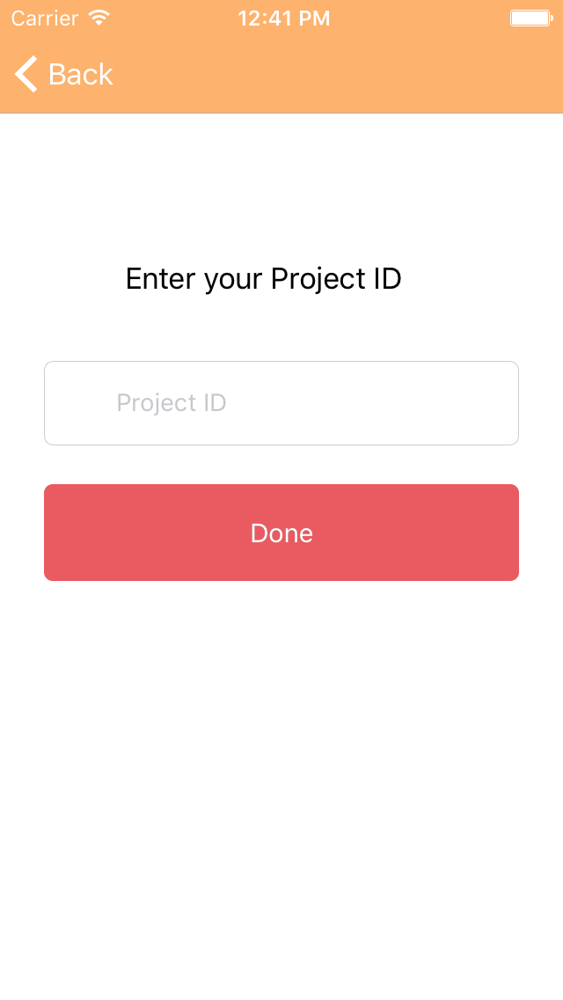
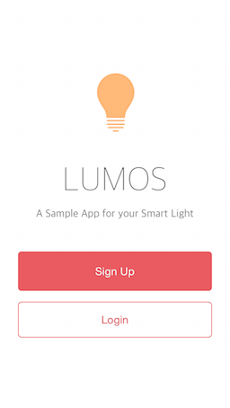

# MODE-iOSSDK

## Overview
MODE-iOSDK provides a wrapper for the [MODE](http://www.tinkermode.com) cloud [API](http://dev.tinkermode.com/docs/api/) and handles the data objects connecting iOS apps, devices and Smart Modules.

With this SDK, you can implement iOS apps for your MODE project with ease.

## Requirements

This SDK works on iOS 7 and up. The library depends on [Mantle](https://github.com/Mantle/Mantle) and [SocketRocket](https://github.com/square/SocketRocket). See more details in `MODE-iOSSDK.podspec`.

## Installation

MODE-iOSSDK is available through [CocoaPods](http://cocoapods.org). To install, simply add the following line to your Podfile:

    pod "MODE-iOSSDK"

## Classes

All classes start with `MODE` as prefix.

### MODEAppAPI
`ModeApp.h` defines the API wrapper class, `MODEAppAPI`, that interacts with the MODE cloud service. Each method corresponds to a [MODE cloud API](http://dev.tinkermode.com/docs/api/) endpoint.

All methods are asynchronous, so you need to pass a callback function as an `Objective-C` block and check the `NSError` object when the block is called. Whenever an error happens, `NSError` has a non-nil value. Otherwise it means the call was successful.

The callback block is called in the main GUI thread by default. So you can call other UI-related APIs from the callback. If you want to change the behavior, please set the `EXECUTE_BLOCK_IN_MAIN_THREAD` macro value to `0` in `ModeApp.m`.

See comments in `ModeApp.h` for detailed documentation on the class methods.

### MODEData
`ModeData.h` defines the data classes, each corresponding to a [JSON schema defined by MODE](http://dev.tinkermode.com/docs/api/models.html). A JSON object is parsed and each of its properties is stored as the expected data type.  One exception is `eventData` in `MODEDeviceEvent`. It is an `NSDictionary`, as its actual structure is determined by developers.

The classes are sub-classes of `MTLModel`, so you can use the nifty [Mantle](https://github.com/Mantle/Mantle) functions.

### MODEEventListener
`MODEEventListener` is a class for maintaining connection to the MODE cloud and receiving events delivered by MODE. Do not delete the object while your app is waiting for events.

## Usage Example

The following is a code snippet that listens to events. The sample code doesn't check for errors, so make sure you add more error checking if you want to reuse the code.

You need to define a project on the [MODE Developer Console](https://console.tinkermode.com/). You also need to define an app for your project. For detailed instructions on setting up a MODE project, see the [Getting Started](http://dev.tinkermode.com/docs/getting_started.html) tutorial. Here we assume `projectId` is `1234` and `appId` is `SampleApp1`

    // You have to trigger somewhere with button or menu.
    [MODEAppAPI initiateAuthenticationWithSMS:1234 phoneNumber:@"YOUR PHONE NUMBER"
        completion:(void(^)(MODESMSMessageReceipt* obj, NSError* err)){ /* Need to error check */ };

You will get your verification code via SMS. In the following code snippet, replace `CODE VIA SMS` with this code. Now your app can listen to the events coming from devices or Smart Modules.

    MODEEventListener* listener = nil; // Maybe you should define this as property in the class to keep the object alive.

    [MODEAppAPI authenticateWithCode:1234 phoneNumber:@"YOUR PHONE NUMBER" appId:@"SampleApp1" code:@"CODE VIA SMS"
        completion:(void(^)(MODEClientAuthentication* auth, NSError* err)){

          listner = [[MODEEventListener alloc] initWithClientAuthentication:auth]; 

          [listener startListenToEvents:^(MODEDeviceEvent* event, NSError* err){
            if (event) {
              NSLog(@"Event: %@", event);
            }

          }];
        }];

## Example App

Also included with the SDK is an example app called `Lumos`.  It is a simple controller app for a smart light system.

Go to the `Example` directory and run

    $ pod install

Then open `MODE-iOSSDK.xcworkspace` with Xcode. 

Before you run your app, you need to set up a Project and an App on the [MODE Developer Console](https://console.tinkermode.com/). If you are not familiar with the Developer Console, please read our [documentation](http://dev.tinkermode.com/docs/) first.

Build the app and run it in the iOS simulator or your iOS machine. You should see the following screen when the app launches:

Find your `Project ID` on the console of sample project. Type the `Project Id` press `Done` button. Then you should see the following launch screen:

If you want to change the `Project ID` later, you can go to the Setting -> Lumos page from the iOS home page. Or reinstall Lumos after you uninstall it. For full instructions on building an iOS app for your MODE project, see this [tutorial](http://dev.tinkermode.com/docs/lumos.html).

The `App ID` is fixed as `controller_app` in `LMDataHolder.m`. `controller_app` is already predefined in the Sample project. Please replace it if you want to assign other `App ID` and rebuild Lumos on Xcode.

    if (self) {
        self.members = [[LMDataHolderMembers alloc] init];
        
        // You would need to setup appId according to your App settings.
        // The sample project pregenerates "controller_app" App. So you don't have to change the project
        // if you use it as it is.
        // Please see more detail (http://dev.tinkermode.com/tutorials/getting_started.html) to get them.
        self.appId = @"controller_app";
    }

## Author

Naoki Takano, honten@tinkermode.com

## License

MODE-iOSSDK is available under the MIT license. See the LICENSE file for more info.
